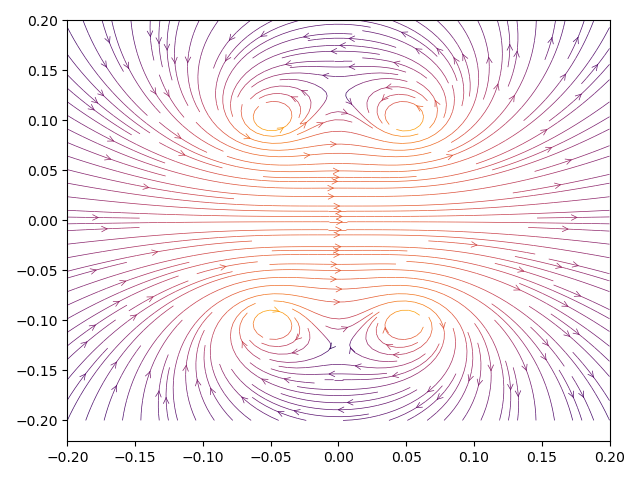

# Magnetic Analysis with GPU Acceleration (MAGA)

MAGA (Magnetic Analysis with GPU Acceleration) is a Python library for GPU-accelerated
magnetic field calculations using the Biot-Savart law. It supports arbitrary coil
geometries via Python or OpenCL geometry generators. GPU acceleration is realized
with OpenCL.

> __magus, maga, magum__ <br>
> _adjective_ <br>
> magic, magical


## License

See [LICENSE.md](./LICENSE.md)

## Installation

```
pip install pymaga
```

## Usage

Detailed usage examples can be seen in the ```examples``` directory.

## Validation



Validation scenarios can be found in the ```verification``` directory.
