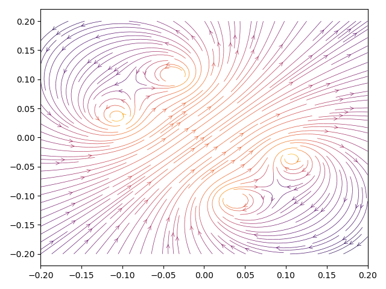

# Helmholtz pair tests

## Case 1

* Center: (0.0, 0.0, 0.0)
* Normal: (0.0, 0.0, 1.0)
* Current: 2.34 A
* Windings: 2
* Discrete elements per coil: 256

| Position | Expected | Result | Deviation | Status |
| --- | --- | --- | --- | --- |
| [50, 50, 50] | 4.2081E-05 T | 4.2082E-05 T | 0.0020% | Ok |
| [50, 50, 45] | 4.2007E-05 T | 4.2008E-05 T | 0.0023% | Ok |
| [50, 50, 55] | 4.2007E-05 T | 4.2008E-05 T | 0.0023% | Ok |
| [50, 50, 60] | 4.1045E-05 T | 4.1046E-05 T | 0.0029% | Ok |
| [50, 50, 65] | 3.7920E-05 T | 3.7921E-05 T | 0.0030% | Ok |
| [50, 50, 35] | 3.7920E-05 T | 3.7921E-05 T | 0.0030% | Ok |
| [50, 50, 70] | 3.2505E-05 T | 3.2505E-05 T | 0.0021% | Ok |
| [62, 50, 50] | 4.0907E-05 T | 4.0907E-05 T | 0.0002% | Ok |
| [70, 50, 50] | 3.0856E-05 T | 3.0853E-05 T | 0.0085% | Ok |
| [60, 50, 55] | 4.2619E-05 T | 4.2620E-05 T | 0.0019% | Ok |
| [60, 50, 60] | 4.3786E-05 T | 4.3788E-05 T | 0.0038% | Ok |
| [65, 50, 55] | 4.2467E-05 T | 4.2467E-05 T | 0.0008% | Ok |
| [48, 50, 50] | 4.2081E-05 T | 4.2082E-05 T | 0.0020% | Ok |
| [52, 50, 50] | 4.2081E-05 T | 4.2082E-05 T | 0.0020% | Ok |
## Case 2

* Center: (0.0, 0.0, 0.0)
* Normal: (1.0, 0.0, 1.0)
* Current: 2.34 A
* Windings: 2
* Discrete elements per coil: 256

| Position | Expected | Result | Deviation | Status |
| --- | --- | --- | --- | --- |
| [50, 50, 50] | 4.2081E-05 T | 4.2082E-05 T | 0.0020% | Ok |
| [55, 50, 55] | 4.1798E-05 T | 4.1799E-05 T | 0.0026% | Ok |
| [60, 50, 60] | 3.8638E-05 T | 3.8639E-05 T | 0.0030% | Ok |
| [65, 50, 65] | 3.0974E-05 T | 3.0974E-05 T | 0.0018% | Ok |
| [70, 50, 70] | 2.1975E-05 T | 2.1975E-05 T | 0.0005% | Ok |
| [60, 60, 55] | 4.4178E-05 T | 4.4180E-05 T | 0.0041% | Ok |
| [58, 42, 52] | 4.3045E-05 T | 4.3046E-05 T | 0.0027% | Ok |
| [54, 56, 66] | 4.2281E-05 T | 4.2283E-05 T | 0.0043% | Ok |
| [45, 45, 45] | 4.2171E-05 T | 4.2172E-05 T | 0.0026% | Ok |
| [55, 45, 55] | 4.2171E-05 T | 4.2172E-05 T | 0.0026% | Ok |
