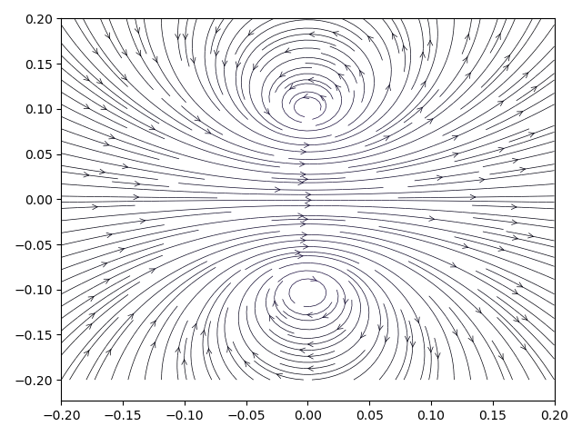
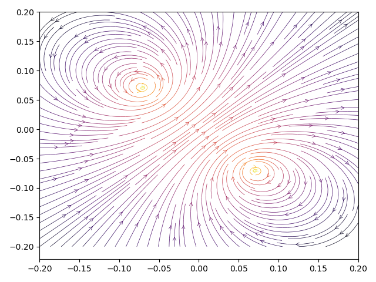

# Single coil tests

## Case 1

* Center: (0.0, 0.0, 0.0)
* Normal: (0.0, 0.0, 1.0)
* Radius: 0.1 m
* Current: 1.23 A
* Discrete elements: 1024
* Windings: 1

| Position | Expected | Result | Deviation | Status |
| --- | --- | --- | --- | --- |
| [50, 50, 50] | 7.7283E-06 T | 7.7283E-06 T | 0.00031% | Ok |
| [50, 50, 45] | 7.2868E-06 T | 7.2868E-06 T | 0.00028% | Ok |
| [50, 50, 55] | 7.2868E-06 T | 7.2868E-06 T | 0.00028% | Ok |
| [50, 50, 60] | 6.1858E-06 T | 6.1858E-06 T | 0.00018% | Ok |
| [50, 50, 65] | 4.8728E-06 T | 4.8728E-06 T | 0.00006% | Ok |
| [50, 50, 70] | 3.6798E-06 T | 3.6798E-06 T | 0.00005% | Ok |
| [62, 50, 50] | 9.4358E-06 T | 9.4359E-06 T | 0.00046% | Ok |
| [70, 50, 50] | 1.7443E-05 T | 1.7444E-05 T | 0.00125% | Ok |
| [60, 50, 55] | 8.1029E-06 T | 8.1030E-06 T | 0.00033% | Ok |
| [60, 50, 60] | 6.5078E-06 T | 6.5078E-06 T | 0.00018% | Ok |
| [65, 50, 55] | 9.4243E-06 T | 9.4243E-06 T | 0.00041% | Ok |
| [55, 50, 60] | 6.2683E-06 T | 6.2683E-06 T | 0.00018% | Ok |
| [60, 60, 55] | 9.1295E-06 T | 9.1296E-06 T | 0.00040% | Ok |
| [58, 42, 52] | 9.0554E-06 T | 9.0554E-06 T | 0.00042% | Ok |
| [54, 56, 66] | 4.6067E-06 T | 4.6067E-06 T | 0.00002% | Ok |
## Case 2

* Center: (0.0, 0.0, 0.0)
* Normal: (1.0, 0.0, 1.0)
* Radius: 0.1 m
* Current: 1.23 A
* Discrete elements: 128
* Windings: 1

| Position | Expected | Result | Deviation | Status |
| --- | --- | --- | --- | --- |
| [50, 50, 50] | 7.7283E-06 T | 7.7299E-06 T | 0.02008% | Ok |
| [55, 50, 55] | 6.8857E-06 T | 6.8868E-06 T | 0.01562% | Ok |
| [60, 50, 60] | 5.0959E-06 T | 5.0962E-06 T | 0.00547% | Ok |
| [65, 50, 65] | 3.4260E-06 T | 3.4259E-06 T | 0.00514% | Ok |
| [70, 50, 70] | 2.2448E-06 T | 2.2445E-06 T | 0.01374% | Ok |
